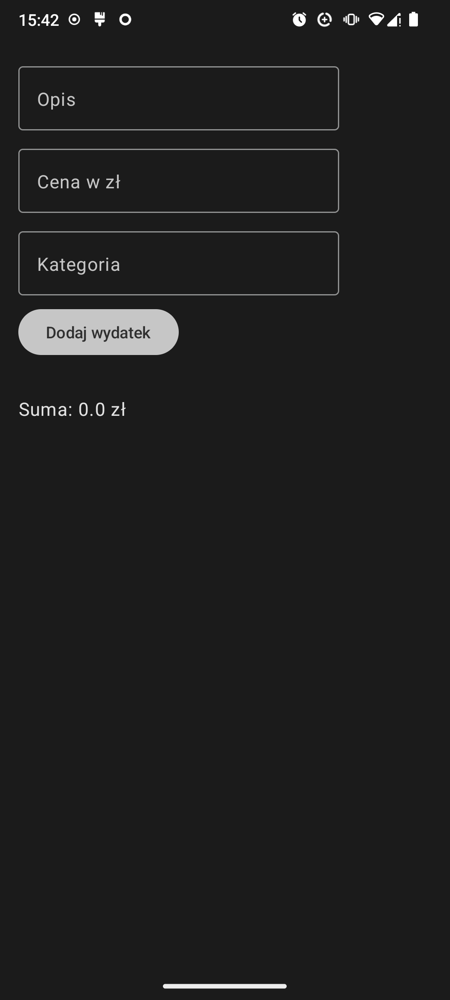
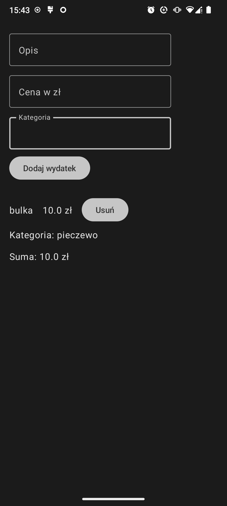

# JetSpend3 - Aplikacja do Śledzenia Wydatków

## Opis

JetSpend3 to aplikacja mobilna napisana w języku Kotlin przy użyciu Jetpack Compose, która umożliwia śledzenie osobistych wydatków. Aplikacja pozwala użytkownikom na dodawanie, przeglądanie oraz usuwanie wydatków, a także oblicza łączną sumę wszystkich wpisanych wydatków.

## Funkcjonalności

- **Dodawanie wydatków**: Użytkownik może wprowadzić opis, kwotę oraz kategorię wydatku, a następnie dodać go do listy.
- **Przeglądanie wydatków**: Wszystkie dodane wydatki są wyświetlane w formie listy.
- **Usuwanie wydatków**: Użytkownik może usunąć wybrany wydatek z listy.
- **Sumowanie wydatków**: Aplikacja oblicza i wyświetla łączną sumę wszystkich wydatków.

## Instalacja

1. Sklonuj to repozytorium na swoje urządzenie:
    ```
    git clone https://github.com/twoje-konto/JetSpend3.git
    ```

2. Otwórz projekt w Android Studio.

3. Zbuduj projekt oraz uruchom aplikację na emulatorze lub fizycznym urządzeniu.

## Użycie

1. Uruchom aplikację na swoim urządzeniu.
2. Dodaj nowy wydatek, wypełniając pola opisu, kwoty oraz kategorii, a następnie klikając przycisk "Dodaj wydatek".
3. Przeglądaj listę dodanych wydatków.
4. Usuń wydatek, klikając przycisk "Usuń" obok wybranego wpisu.
5. Sprawdź łączną sumę wydatków, wyświetlaną na dole ekranu.

## Zrzuty Ekranu





   


